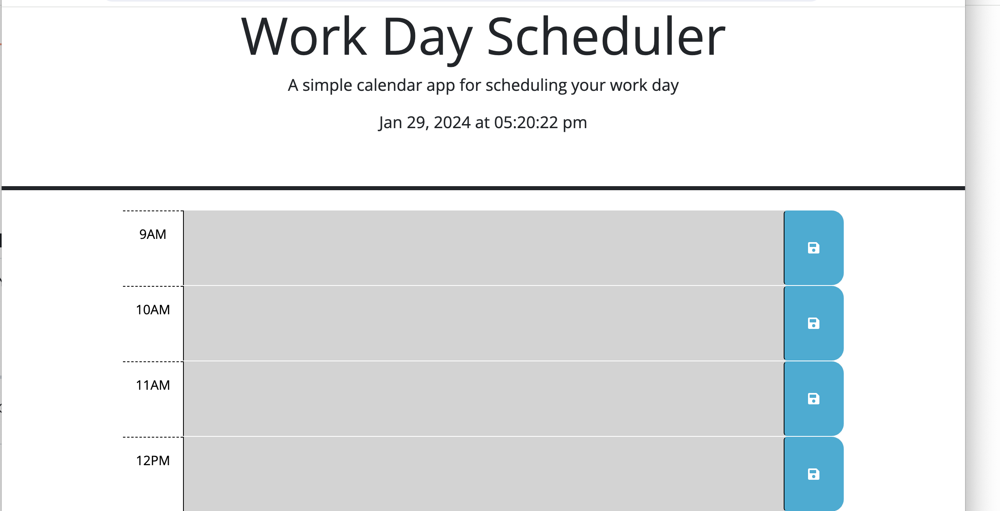

# Third-Party APIs: Work Day Scheduler

## Description

Create a simple calendar application that allows a user to save events for each hour of a typical working day (9am&ndash;5pm) by modifying starter code. This app will run in the browser and feature dynamically updated HTML and CSS powered by jQuery.
You'll need to use the [Day.js](https://day.js.org/en/) library to work with date and time.

## Installation

N/A

## Usage

;

https://github.com/kamilj62/workDayScheduler

To use this Horiseon Webpage, you can review the notes in each section. For suggestions on what to study first, open the Chrome DevTools by pressing Command+Option+I (macOS) or Control+Shift+I (Windows). A console panel should open either below or to the side of the webpage in the browser. There you will see a list of topics we learned from the prework along with a suggestion on which topic to study first.

## Credits

N/A

## License

Please refer to the LICENSE in the repo.
